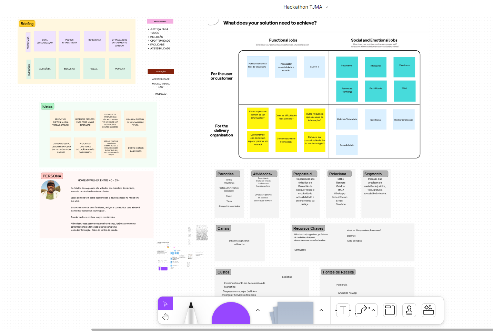
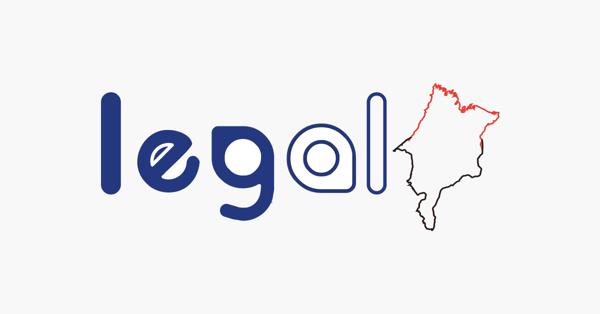

<h1 align="center">
    
     
    📚 Maranhão Legal 📚
</h1>

<h4 align="right">
        Acesse agora nosso site!
        <a href="https://maranhao-legal.herokuapp.com/">
        clique aqui
        </a>
</h4>

<h3 align="center">
    Por que a melhor justiça é fácil e acessível
</h3>

  <a href="#sobre">Maranhão Legal</a>&nbsp;&nbsp;&nbsp;|&nbsp;&nbsp;&nbsp;
  <a href="#nosso-produto-resumo">Nosso Produto</a>&nbsp;&nbsp;&nbsp;|&nbsp;&nbsp;&nbsp;
  <a href="#tecnologias">Tecnologias</a>&nbsp;&nbsp;&nbsp;|&nbsp;&nbsp;&nbsp;
  <a href="#fluxo-de-usuário-e-produto-completo">Fluxo de usuário e produto completo</a>&nbsp;&nbsp;&nbsp;|&nbsp;&nbsp;&nbsp;
  <a href="#Nosso-time">Nosso time</a>&nbsp;&nbsp;&nbsp;|&nbsp;&nbsp;&nbsp;
  <a href="#o-produto">Produto</a>

## Sobre

#### Maranhão Legal

O projeto tem como missão fazer com que as sentenças judiciais fiquem mais fáceis de entender para a população maranhense que não tem domínio técnico na disciplina judiciária ou que não tem acesso a internet estável.

Em 2019, o Maranhão atingiu o maior percentual de pessoas sem instrução: 16,6% da população com 25 anos ou mais de idade nunca frequentou a escola ou possui o curso de ensino fundamental incompleto. 

O Maranhão também ficou entre os últimos estados brasileiros no ranking de acesso à Internet: apenas 67,4% da população maranhense utilizou a Internet naquele ano.

O que causa diversos problemas para a população maranhense no que diz respeito ao acesso a justiça e ao entendimento da mesma.

## Nosso produto (Resumo)

Somos uma plataforma digital que promove facilidade do entendimento das sentenças públicas do estado do Maranhão. Atuamos em 4 principais frentes:

1. Todas as sentenças públicas do estado do Maranhão ficam disponíveis no site

2. Qualquer cidadão maranhense pode procurar os processos ligados ao seu CPF. 

3. Esse cidadão vai ter a listagem de todos os processos que tem sentença definida até o momento atual. 

4. Dentro dos processos o indivíduo vai poder ver a sentença resumida visualmente, além de poder ouvir, baixar, imprimir e enviar essa sentença.

#### Tela de Login - Minigame em dupla - Tela com ranking
  |   |    |  
:---------------:|:----------------:|:-----------------:|

## Tecnologias

Esse repositório trata do backend serveless do **Firebase**, utilizando a linguagem **Javascript**.

Escolhermos o Firebase para compor nosso banckend por ser uma solução robusta e gratuita, além de permitir o armazenamento dos dados de forma simples e eficiente.

  
Tecnologias detalhadas

 - Javascript
 - Firebase
 - Firestore database

 

## Fluxo de usuário e produto completo

Desenho do aplicativo no Figma:

 

Acesse agora nosso site,
<a href="https://maranhao-legal.herokuapp.com/">
clique aqui.
</a>

## Nosso time:

Jonas Nascimento – Desenvolvedor FullStack e Empreendedor na área de Educação Digital.  
Laís Cosmo Lopes – Profissional de Marketing e Empreendedora na área de Educação Digital.  
Victor Ferreira – Gerente de produto e empreendedor educação digital. 
Jonas Alves – Desenvolvedor Frontend.

 

Você pode acessar nossas redes pelos botões abaixo: (CTRL + click)

Jonas Nascimento:&nbsp;
&nbsp;&nbsp;&nbsp;
&nbsp;&nbsp;&nbsp;

Laís Cosmo Lopes:&nbsp;
&nbsp;&nbsp;&nbsp;

Victor Ferreira:&nbsp;&nbsp;&nbsp;&nbsp;&nbsp;&nbsp;&nbsp;
&nbsp;&nbsp;&nbsp;

Jonas Alves:&nbsp;&nbsp;&nbsp;&nbsp;&nbsp;&nbsp;&nbsp;&nbsp;&nbsp;&nbsp;&nbsp;
&nbsp;&nbsp;&nbsp;
&nbsp;&nbsp;&nbsp;

Ana Priscila:&nbsp;&nbsp;&nbsp;&nbsp;&nbsp;&nbsp;&nbsp;&nbsp;&nbsp;&nbsp;&nbsp;&nbsp;&nbsp;&nbsp;&nbsp;&nbsp;&nbsp;&nbsp;&nbsp;&nbsp;&nbsp;&nbsp;&nbsp;&nbsp;&nbsp;&nbsp;&nbsp;&nbsp;&nbsp;&nbsp;&nbsp;&nbsp;&nbsp;&nbsp;&nbsp;&nbsp;

 

## O Produto

Após passar por uma longa jornada de desenvolvimento de produto, validações e workshops de entedimento conseguimos chegar ao que está sendo exposto hoje.

### Como funciona? 
O aluno é levado a nossa plataforma como parte do sistema de ensino do curso. 
Dentro do aplicativo ele acessará com login e senha, após realizar a autenticação e-mail + PIN numérico aleatório, código do desafio e autorizar os dispositivos de acesso. 
Posteriormente, toda semana os alunos têm uma faixa de horário que devem estar presentes no app para executar um projeto. Eles entrarão na plataforma optativamente câmera e microfone e podem utilizar o chat. E assim são formados os times.

O desafio proposto é apresentado a eles um desafio voltado para o módulo que os alunos estão. O aluno de forma aleatório é pareado com outro aluno de quem precisa para conseguir seguir adiante com exercícios propostos. 
Os resultados dos exercícios propostas mais a interação são pontuados e vão criando ranking na plataforma. O ranking servirá para dar destaque aos alunos e, também descontos a partir de uma certa pontuação os alunos vão ganhando descontos na mensalidade do curso até 5% ou descontos em outros cursos da instituição. 

A proposta é inovadora, pois além de ser uma plataforma que solucionar o problema proposto e ser educativa, se torna também uma ferramenta de marketing boca a boca, uma vez que todas as pessoas gostariam de uma plataforma em que elas podem obter descontos acumulativos mediante o próprio esforço.

